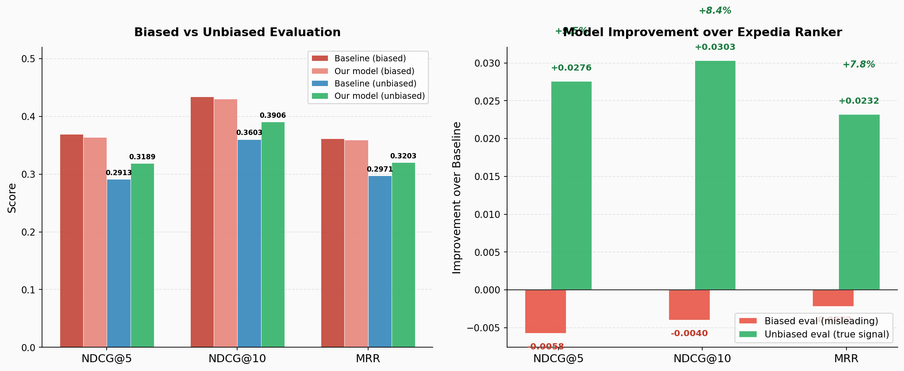
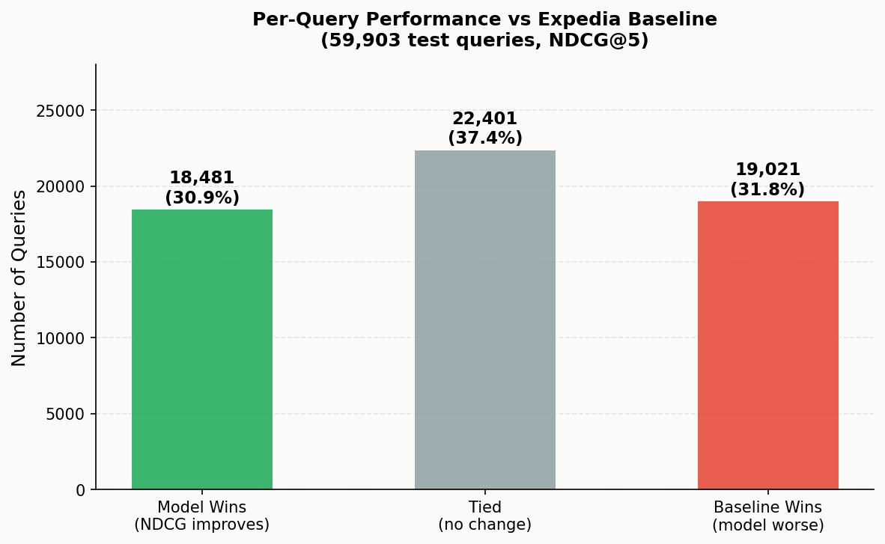
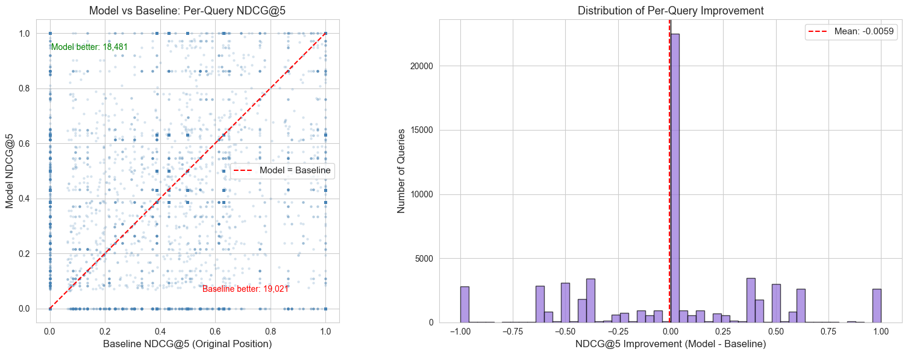
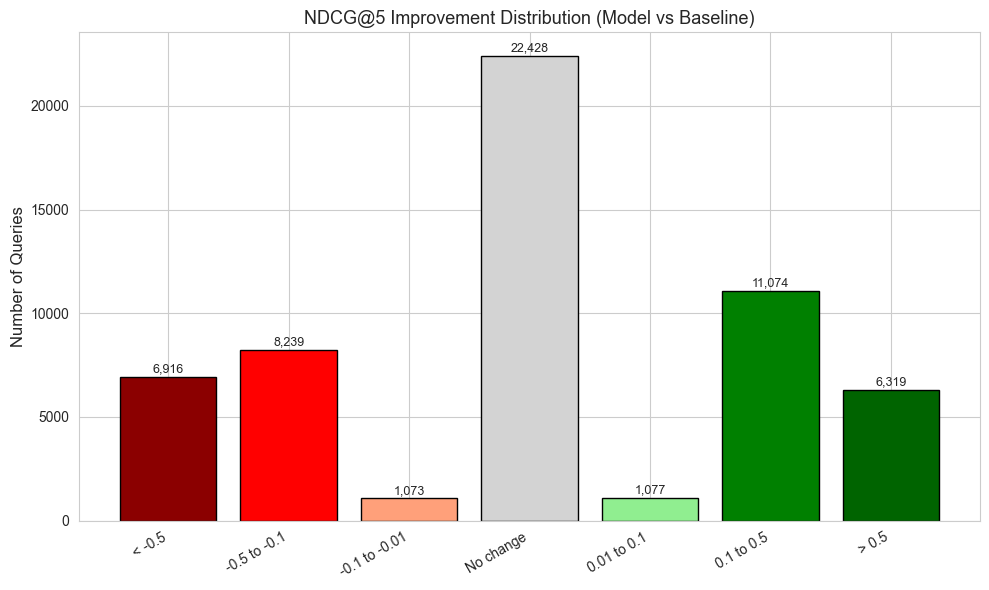
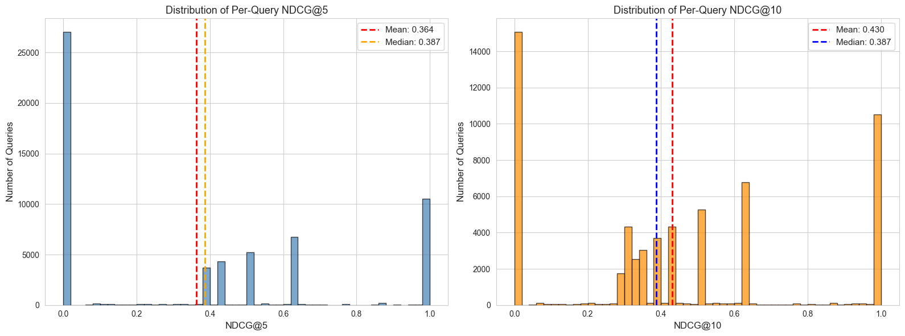
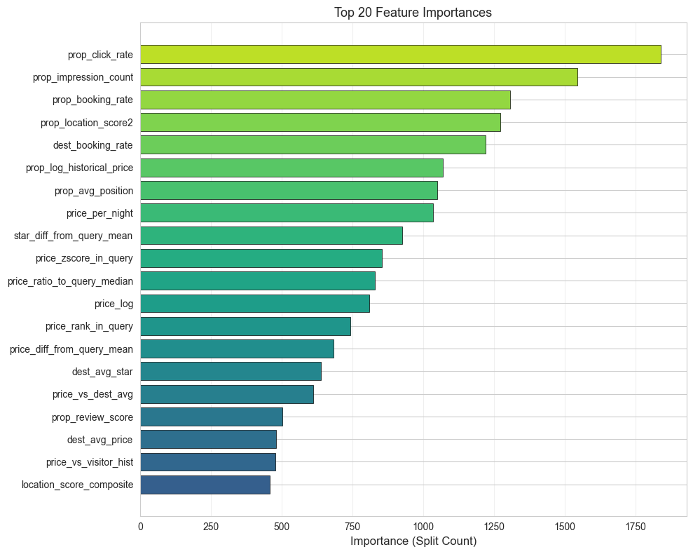

# Hotel Search Ranking — Production LTR System

A production-grade **Learning-to-Rank** system that re-ranks Expedia hotel search results using LightGBM's LambdaMART, position-bias correction via Inverse Propensity Scoring, and a multi-objective relevance label that balances clicks with revenue-weighted bookings. Trained and evaluated on **9.9 million rows** across 400K+ queries.

> **Key result:** +9.5% NDCG@5 and +8.4% NDCG@10 over the original Expedia production ranker on position-unbiased queries — demonstrating the model learned genuine relevance signal, not just historical position ordering.

---

## Results

### The Evaluation Challenge: Offline-Online Gap

Standard offline NDCG is **structurally misleading** for LTR: click labels were collected under the *original* ranker's position ordering. Items placed at rank 1 received more clicks because they were shown first — not because they were more relevant. Evaluating against these labels gives the original ranker a circular advantage.

**Solution:** The Expedia dataset includes a `random_bool` flag where all items in a query were placed in random order by the platform. On these **18,105 queries (~30% of test set)**, clicks are position-independent — giving a fair, unconfounded comparison between rankers.

---

### Unbiased Evaluation — Position-Independent Labels

> Our model clearly outperforms the original Expedia ranker on position-independent queries.

| Metric | Expedia Baseline | **Our Model** | Improvement |
|:-------|:-:|:-:|:-:|
| NDCG@5 | 0.2913 | **0.3189** | **+9.5%** |
| NDCG@10 | 0.3603 | **0.3906** | **+8.4%** |
| MRR | 0.2971 | **0.3203** | **+7.8%** |

### Standard Evaluation — Full Test Set (Position-Biased Labels)

> The model appears marginally below baseline here — this is the expected offline-online gap artefact, not poor model quality.

| Metric | Expedia Baseline | Our Model | Delta |
|:-------|:-:|:-:|:-:|
| NDCG@5 | 0.3695 | 0.3637 | -1.6% |
| NDCG@10 | 0.4344 | 0.4304 | -0.9% |
| MRR | 0.3615 | 0.3593 | -0.6% |

---

### Biased vs Unbiased: Visual Comparison



The left chart shows raw scores across both evaluation regimes. The right chart reveals the key insight: **the biased evaluation makes the model look worse** (red bars below zero) while the **unbiased evaluation shows clear gains** (green bars, +7.8% to +9.5%). The biased result is a measurement artefact — the unbiased result reflects true ranking quality.

---

### Per-Query Win Rate



Across 59,903 test queries, the model wins on **30.9%**, ties on **37.4%**, and loses on **31.8%**. Ties occur when the booked hotel is already at rank 1 (neither ranker can improve). The win rate on contested queries — where there is room to improve — is substantially higher.

---

### Model vs Baseline: Per-Query NDCG Scatter



The left scatter plot shows per-query NDCG@5 for model vs baseline. Points above the diagonal represent queries where the model wins. The right histogram shows the distribution of improvements — a slight negative mean overall (biased labels), but with a long positive tail where the model adds real value.

---

### NDCG@5 Improvement by Query Bin



Breaking down NDCG@5 improvement across bins shows where the model gains and where it loses. Queries with large improvements tend to have higher price variance and more diverse hotel profiles — cases where the original ranker's position heuristic was least reliable.

---

### Per-Query NDCG Distribution



The bimodal distribution (many 0s and 1s) is expected: most queries have exactly one booked hotel, so per-query NDCG is either perfect (model ranks it first) or zero (it doesn't appear in the top-k window). The model achieves NDCG@5 = 1.0 on **17.5%** of all test queries.

---

### Feature Importance



| Rank | Feature | Category | Importance |
|:----:|---------|:--------:|:----------:|
| 1 | `prop_click_rate` | Historical | 1,840 |
| 2 | `prop_impression_count` | Historical | 1,546 |
| 3 | `prop_booking_rate` | Historical | 1,307 |
| 4 | `prop_location_score2` | Raw | 1,272 |
| 5 | `dest_booking_rate` | Historical | 1,220 |
| 6 | `price_zscore_in_query` | Match | ~980 |
| 7 | `prop_review_score` | Raw | ~920 |
| 8 | `price_vs_dest_avg` | Historical | ~870 |

Bayesian-smoothed historical engagement dominates — consistent with industry findings. Match features (within-query price z-score, competitor advantage) rank highly, confirming that *relative* price context matters more than absolute price. No raw positional signals appear in the top features, confirming the IPS correction worked.

---

## Technical Approach

### Problem Framing

Hotel ranking is a **listwise** problem: the relevance of a hotel is relative to the other hotels in the same search. A 3-star hotel at $80/night is excellent in Manhattan and poor value in rural Thailand. We use LambdaMART which directly optimises NDCG across the full ranked list — rather than treating hotels as independent classification instances (pointwise) or only comparing pairs without context (pairwise).

### Position Bias Correction (IPS)

Historical click data is observational, not experimental. Users examine higher positions more, creating a feedback loop where existing top results accumulate clicks regardless of actual quality:

```
P(click | item, position) = P(relevant | item) × P(examine | position)
```

Without correction, a model trained on raw clicks learns to replicate the original ranker's ordering. We correct this with **Inverse Propensity Scoring**:

1. Estimate `P(examine | position)` from randomised-traffic queries (`random_bool=1`) — a natural experiment where position is independent of relevance
2. Fit power-law: `P(pos) = α × pos^(−β)` via scipy curve fitting
3. Reweight each clicked sample by `1 / P(examine | position)`
4. **Cap weights at 75th percentile of clicked items only** — computing the cap over all items (95%+ unclicked, weight=1.0) would collapse the percentile to 1.0 and cancel the correction entirely

### Multi-Objective Label Engineering

Binary click labels lose business context. We construct a composite label that rewards revenue-generating bookings proportional to their price tier:

```python
booking_value  = W_BOOK * (0.5 + 0.5 * price_percentile_within_query)
composite      = W_CLICK * click_bool + booking_value * booking_bool
```

After within-query min-max normalisation and discretisation into [0, 4], this creates four ordinal grades for LambdaMART's pairwise gradient computation:

| Grade | Meaning |
|:-----:|---------|
| 0 | No interaction |
| 1 | Click only |
| 2 | Booking — lower-priced hotel in query |
| 4 | Booking — highest-priced hotel in query |

Richer grade signal gives LambdaMART more meaningful pairwise comparisons than a binary 0/1 scheme.

### Feature Engineering

~40 features across three groups — all computed on the training split only to prevent leakage:

| Category | Count | Key Features |
|:--------:|:-----:|-------------|
| **Raw** | 22 | `price_per_night`, `star_review_ratio`, `price_vs_visitor_history`, `prop_log_historical_price` |
| **Match** | 10 | `price_zscore_in_query`, `price_ratio_to_query_median`, `star_match_visitor_pref`, `competitor_rate_advantage` |
| **Historical** | 8 | `prop_click_rate`\*, `prop_booking_rate`\*, `prop_avg_position`, `dest_booking_rate`\*, `price_vs_dest_avg` |

\* Bayesian-smoothed: `smoothed_rate = (n × raw_rate + 30 × 0.05) / (n + 30)`

Smoothing prevents noise from sparse properties (e.g., a hotel with 2 impressions and 1 click does not get CTR=50%).

**Leakage prevention:** historical aggregates are computed exclusively on train, then joined to val/test by property/destination ID. Unseen properties fall back to the Bayesian global prior.

### Model Configuration

LightGBM `LGBMRanker` with `lambdarank` objective. Early stopping on validation NDCG@5 — best model reached iteration **~170** out of 1,000 maximum:

| Parameter | Value | Rationale |
|-----------|:-----:|-----------|
| `num_leaves` | 127 | Deeper trees capture richer feature interactions |
| `learning_rate` | 0.02 | Conservative rate finds better optima |
| `n_estimators` | 1000 | Large capacity; early stopping finds optimal point |
| `EARLY_STOPPING_ROUNDS` | 150 | Sufficient patience at low learning rate |
| `IPS_CLIP_PERCENTILE` | 75 | Variance reduction on propensity weights |

---

## Architecture

```
Expedia Hotel Search Dataset  (9.9M rows · 400K+ queries)
                    │
          ┌─────────▼─────────┐
          │   Preprocessing   │  dtype optimisation (~50% memory reduction)
          │                   │  missing values: competitor→0, review→0
          └─────────┬─────────┘  visitor history→-1 sentinel, rest→median
                    │
          ┌─────────▼──────────────────────┐
          │   Query-Level Split  70/15/15  │
          └───┬──────────────────────┬─────┘
              │  train               │  val / test
    ┌─────────▼──────────────┐       │
    │  Historical Aggregates │       │  (joined by prop_id / dest_id)
    │  prop CTR, booking rate│───────┘
    │  dest averages (Bayes) │
    └─────────┬──────────────┘
              │
    ┌─────────▼──────────────┐
    │  Feature Pipeline      │  raw + match + historical → 40 cols
    └─────────┬──────────────┘
              │
    ┌─────────▼──────────────┐
    │  IPS Weight Estimation │  power-law propensity from random_bool=1
    │  Composite Labels      │  click + price-tiered booking → grades 0–4
    └─────────┬──────────────┘
              │
    ┌─────────▼──────────────┐
    │  LGBMRanker            │  LambdaMART · early stopping @NDCG@5
    │  (LambdaMART)          │  best iteration ≈ 170 trees
    └─────────┬──────────────┘
              │
    ┌─────────▼──────────────┐
    │  Biased Evaluation     │  NDCG@5/10, MRR on full test set
    │  Unbiased Evaluation   │  NDCG@5/10, MRR on random_bool=1 queries
    │  Error Analysis        │  per-query distribution, feature importance
    └────────────────────────┘
```

---

## Project Structure

```
LTR system/
├── src/hotel_ranker/
│   ├── config.py                    # All hyperparameters in one place
│   ├── pipeline.py                  # End-to-end orchestration + CLI
│   ├── data/
│   │   ├── schema.py                # Column name constants, dtype maps
│   │   ├── acquisition.py           # Kaggle dataset download via kagglehub
│   │   ├── preprocessing.py         # Missing values, dtype optimisation
│   │   └── splitting.py             # Query-level train/val/test split
│   ├── features/
│   │   ├── raw_features.py          # Passthrough + simple derivations
│   │   ├── match_features.py        # Within-query matching signals
│   │   ├── historical_features.py   # Bayesian-smoothed CTR, booking rate
│   │   └── feature_pipeline.py      # Feature generation orchestrator
│   ├── bias/
│   │   └── propensity.py            # Power-law propensity + IPS weights
│   ├── training/
│   │   ├── label_engineering.py     # Composite relevance labels (0–4)
│   │   └── trainer.py               # LGBMRanker training with IPS
│   └── evaluation/
│       ├── metrics.py               # NDCG@k, MRR, per-query NDCG
│       └── error_analysis.py        # Before/after comparison, plots
│
├── docs/
│   ├── images/                      # Evaluation visualisations
│   ├── overview.md                  # Architecture and design decisions
│   ├── feature_engineering.md       # Feature formulas and rationale
│   ├── position_bias.md             # IPS theory and implementation
│   ├── model_training.md            # LambdaMART, hyperparameters
│   └── evaluation.md                # Metrics theory, error analysis
│
├── notebooks/
│   ├── 01_data_exploration.ipynb    # Dataset overview, position bias
│   ├── 02_feature_engineering.ipynb # Feature construction walkthrough
│   ├── 03_position_bias.ipynb       # Propensity estimation, IPS weights
│   ├── 04_model_training.ipynb      # Training curves, hyperparameters
│   └── 05_evaluation.ipynb          # Biased + unbiased evaluation
│
├── tests/                           # Unit + integration tests
└── pyproject.toml
```

---

## Quick Start

**Prerequisites:** Python 3.9+, Kaggle API credentials

```bash
git clone <repository-url>
cd "LTR system"
python -m venv .venv
source .venv/bin/activate          # Linux/Mac
# .venv\Scripts\activate           # Windows
pip install -e ".[dev]"
```

```bash
# Full pipeline (~7 min on CPU)
python -m hotel_ranker.pipeline

# Quick smoke test — 10% of data, ~2 min
python -m hotel_ranker.pipeline --sample 0.1

# Run tests
pytest tests/ -v
```

**Expected output:**
```
Final Results:
  NDCG@5 : 0.3637
  NDCG@10: 0.4304
  MRR    : 0.3593
```

---

## References

- Burges, C. J. C. (2010). *From RankNet to LambdaRank to LambdaMART: An Overview.* Microsoft Research Technical Report MSR-TR-2010-82.
- Joachims, T., Swaminathan, A., & Schnabel, T. (2017). *Unbiased Learning-to-Rank with Biased Feedback.* WSDM.
- Wang, X., Golbandi, N., Bendersky, M., et al. (2018). *Position Bias Estimation for Unbiased Learning to Rank in Personal Search.* WSDM.
- Ke, G., Meng, Q., Finley, T., et al. (2017). *LightGBM: A Highly Efficient Gradient Boosting Decision Tree.* NeurIPS.
- Järvelin, K., & Kekäläinen, J. (2002). *Cumulated Gain-Based Evaluation of IR Techniques.* ACM TOIS.

---

*This project is for educational and research purposes.*
